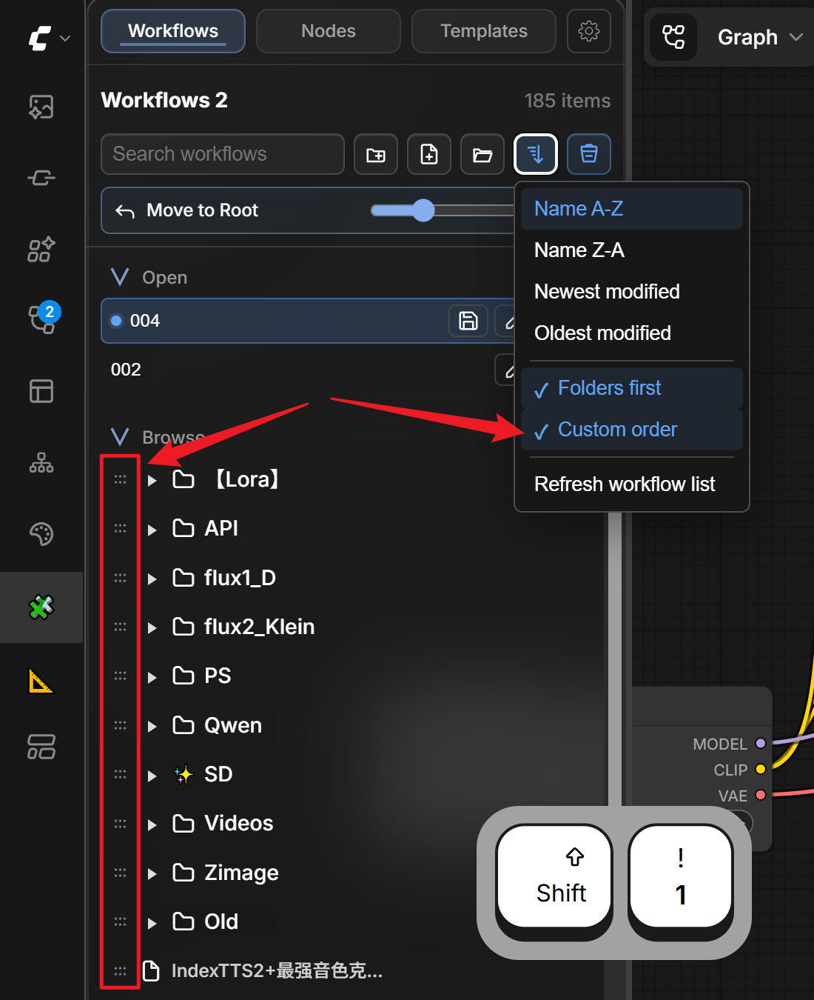
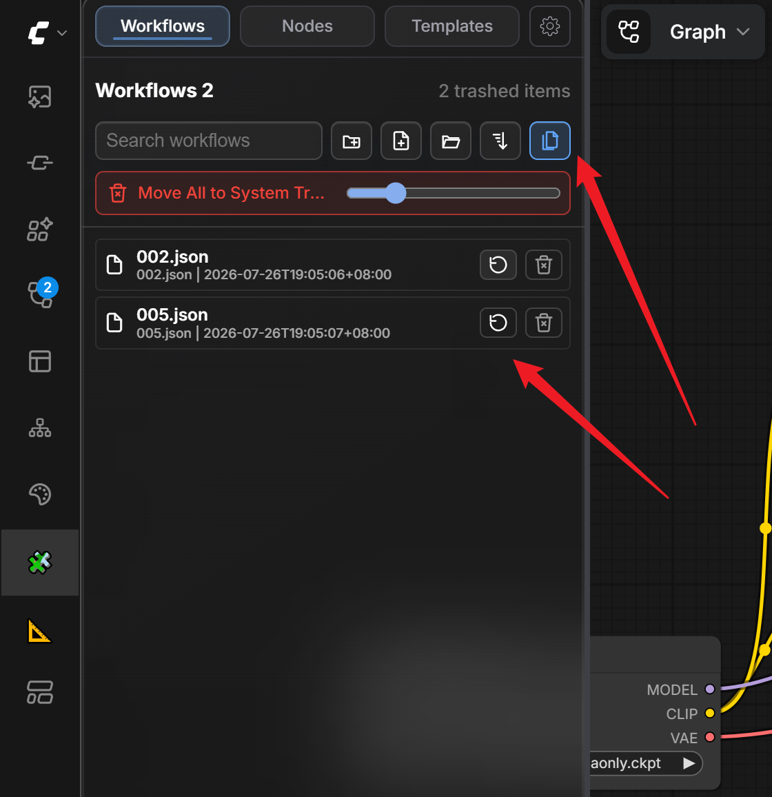
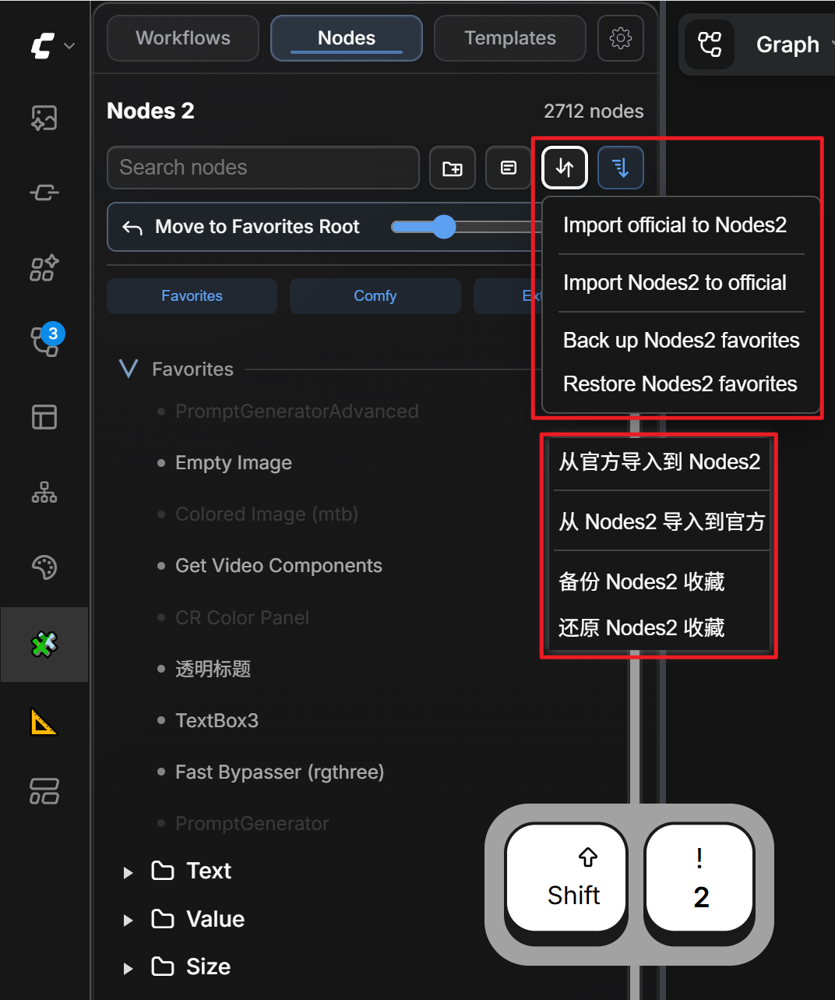
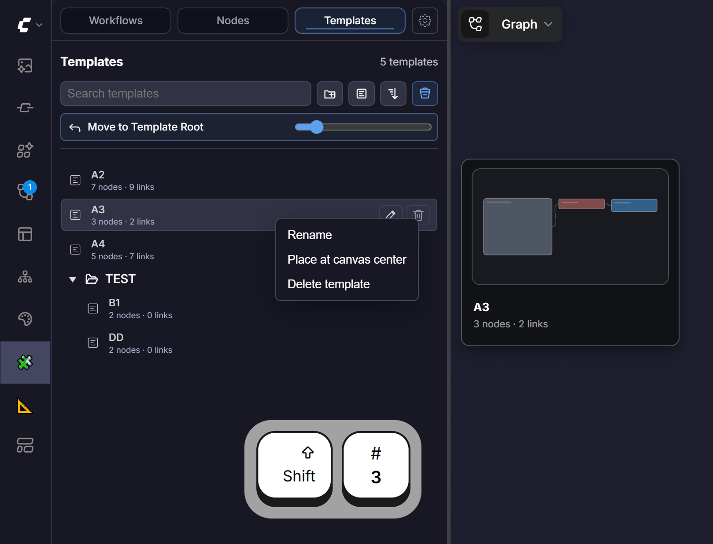
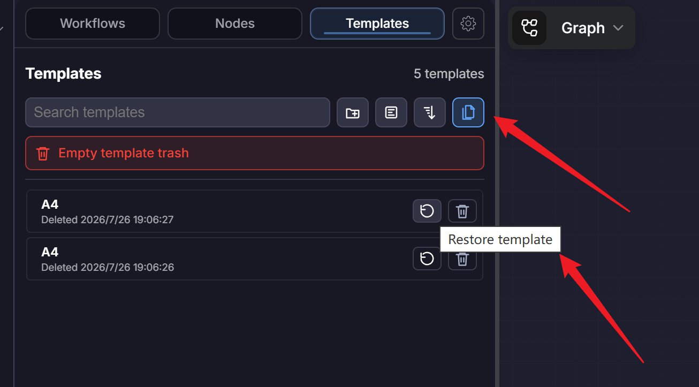

# ComfyUI-WorkspaceKit

**English** · [简体中文](README.zh-CN.md)

> ## A high-efficiency workspace plugin for ComfyUI creators
>
> **Manage workflows, node favorites, and reusable templates efficiently, and organize complex canvases with more capable groups.**


ComfyUI-WorkspaceKit brings workflow management, node favorites, template reuse, and canvas organization into one focused workspace.

Current status: **public beta, 0.2.4**. Back up important workflows, user settings, node favorites, and template data before first using it in a production ComfyUI environment.

**Maintenance note:** Updates and Issue / PR replies may be delayed for the next 2–3 weeks.

<p align="center">
  <a href="#why-workspacekit">Why WorkspaceKit</a> ·
  <a href="#core-features">Core features</a> ·
  <a href="#installation">Installation</a> ·
  <a href="#five-minute-quick-start">Quick start</a> ·
  <a href="#shortcuts">Shortcuts</a> ·
  <a href="#data-safety-and-backups">Data safety</a>
</p>

## Why WorkspaceKit

After using ComfyUI for a while, it is common to run into these problems:

- Workflow files become difficult to browse in a flat list.
- Hundreds of extensions make it harder to find frequently used nodes.
- Repeated node structures need to be rebuilt again and again.
- Large workflows need clearer visual regions and titles.
- Rename, move, delete, and migration operations need a recovery path.

WorkspaceKit brings those daily organization tasks into one workspace sidebar.

| Common problem | WorkspaceKit approach | Result |
| --- | --- | --- |
| Too many workflows | **Workflows 2**: folder tree, search, drag and drop, sorting, recents | Organize by project and find files faster |
| Nodes are hard to find or remember | **Nodes 2**: source categories, search, pinyin search, favorite groups | Build a personal node library |
| Repeated node structures | **Templates**: preserve node positions and links | Save once and reuse anytime |
| Large canvases become hard to read | **Group Enhancements + Title2** | Create clearer work areas and hierarchy |
| Risk of accidental deletion or migration loss | **Two-layer trash + data backup and transfer** | Safer recovery, backup, and migration |

## Core Features

WorkspaceKit provides one unified sidebar entry with three built-in tabs and optional compatible extension tabs:

- **Workflows 2**: Manage workflow files in the ComfyUI workflow directory.
- **Nodes 2**: Browse, search, favorite, group, and organize nodes.
- **Templates**: Save selected connected nodes as reusable templates, organize them with groups, and recover deleted items.
- **Group Enhancements**: Improve canvas group gestures, title-bar controls, and group styling.
- **Title2**: A lightweight visual title and annotation node for complex workflows.

### One entry for core creative assets

The three built-in tabs manage workflow files, node favorites, and node templates. Compatible external tabs can be merged or shown independently through user settings; when a compatible tab is pinned, `Shift+4` opens it.

### Turn frequent actions into reusable assets

Node favorites and templates turn your usual nodes, connected structures, and organization habits into reusable personal assets.

### Efficient, with recovery in mind

Workflows and templates each provide recoverable trash. Data import and official-favorites write operations create the appropriate backup first to reduce risk during organization and migration.

## Features

### Workflows 2

Workflows 2 is for workflow-file organization, especially when you have many `.json` workflows.

Key features:

- Uses the official ComfyUI workflow directory by default.
- Tree-style folders and subfolders.
- Create, rename, copy, drag, and organize workflow files and folders.
- Drop support for folders, expanded folder areas, and the root area.
- Recoverable plugin trash before optional operating-system trash.
- Sorting, custom order, and folder-first sorting.
- Recent workflow history with configurable item count.
- Search, clear search, refresh, and direct workflow opening.
- Open a workflow's file location.
- Folder icon and color customization.
- `Ctrl + click` a folder or group with child levels to recursively expand or collapse it.

> **Note:** Recursive toggle applies to tree folders and groups, not section headers such as Open / Browse or Favorites / Comfy / Extensions. While a search is active, matching paths stay visible, so a collapsed result is not visually hidden.





**Quick access:** `Shift+1` / `Shift+W`

| Search-bar action | Purpose |
| --- | --- |
| Create folder | Create a folder in the current browse location. |
| Create workflow | Create an empty workflow. |
| Import | Select and import a workflow from disk. |
| Sort | Choose name, modified-time, or custom ordering; folders can be prioritized. |
| Trash | Open deleted workflows; click again to return to the workflow list. |

Advanced users can choose a custom workflow root. Use a dedicated workflow directory only; do not use a drive root, Desktop, Downloads, or a large project directory.

### Nodes 2

Nodes 2 is for node discovery, favorites, and organization in large ComfyUI installs.

Key features:

- Reads available nodes from the current ComfyUI environment.
- Separates **Comfy** nodes and **Extensions**.
- Groups extension nodes by plugin source.
- Search with fuzzy search and pinyin search.
- Favorite root, favorite groups, and favorite subgroups.
- Drag nodes into favorite groups or to the canvas.
- Click a node, then click the canvas to place it.
- Detailed and compact node previews.
- Import, export, backup, and restore official ComfyUI favorites and WorkspaceKit favorites.
- Missing third-party nodes are dimmed instead of silently removed.
- Node caching improves first display for large node libraries.



**Quick access:** `Shift+2` / `Shift+N`

| Search-bar action | Purpose |
| --- | --- |
| New favorite group | Create a node-favorites group. |
| Preview mode | Switch between detailed and compact node previews. |
| Sort | Change the node display order. |
| Favorite Manager | Import, export, back up, and restore official and WorkspaceKit favorites. |

### Templates

Templates are reusable connected node groups. Use them for common structures such as loaders, preprocessing, control blocks, output chains, or post-processing chains.

Key features:

- Press `Alt+C` to save selected connected nodes as a template.
- Preserves relative node positions and links.
- Drag templates to the canvas or click a template and then the canvas to place it.
- Template groups and subgroups.
- Template search, sorting, inline rename, deletion, trash, and restore.
- Template hover preview.
- Context menu actions: rename, place at canvas center, and delete.
- Inline delete confirmation for templates and template groups, followed by recoverable template trash.





**Quick access:** `Shift+3` · **Save template:** `Alt+C`

| Search-bar action | Purpose |
| --- | --- |
| New template group | Create a template group. |
| Save selected nodes as template | Save the selected connected nodes. |
| Sort | Change template ordering. |
| Trash | View, restore, or permanently clear deleted templates. |

During the beta compatibility period, template data continues to use the existing Workspace2-compatible location under the ComfyUI user directory. Existing template data remains available after upgrading to WorkspaceKit. Back up important template data regularly.

### Group Enhancements

Group Enhancements make canvas groups closer to common design-tool behavior.

Key features:

- `Ctrl+G` creates a WorkspaceKit group from selected nodes.
- `Shift+G` removes one or more selected WorkspaceKit group frames without deleting their nodes.
- `Ctrl/Meta + left click` toggles Ignore; `Alt + left click` toggles Disable.
- `Shift + left click` adds or removes a WorkspaceKit group from transient multi-selection.
- `Ctrl + drag` on blank canvas extends ComfyUI's native marquee to WorkspaceKit groups.
- `Delete` removes selected WorkspaceKit group frames while keeping nodes and links.
- Right-click a group title bar to edit its style.
- Save the current group style as a default preset.
- Configure margin, border, shadow, animation, and related visual settings.
- Group data is saved in the workflow.

If `Ctrl+G` conflicts with an official ComfyUI keybinding, change the official binding first or disable the WorkspaceKit Ctrl+G option in settings.

### Title2

Title2 is a lightweight visual title and annotation node for large workflows.

Default style:

- Font size: 24
- Background: transparent
- Corner radius: 15

### Data Backup and Transfer

WorkspaceKit can export and import data it manages, which is useful when migrating node favorites, templates, folder metadata, and settings. An automatic backup is created before import. Workflow files and the reproducible node cache are not included in the export package.

## Shortcuts

| Shortcut | Action |
|---|---|
| `Shift+1` / `Shift+W` | Open Workflows 2 |
| `Shift+2` / `Shift+N` | Open Nodes 2 |
| `Shift+3` | Open Templates |
| `Shift+4` | Open the pinned compatible extension tab, when present |
| `Alt+C` | Save selected nodes as a template |
| `Ctrl+G` | Create WorkspaceKit group |
| `Shift+G` | Ungroup selected WorkspaceKit group frames |
| `Delete` | Remove selected WorkspaceKit group frames; nodes are retained |
| `Ctrl + click` folder toggle | Recursively expand or collapse folders / groups |
| `Ctrl/Meta + left click` group header | Toggle Ignore for the group |
| `Alt + left click` group header | Toggle Disable for the group |
| `Shift + left click` group header | Add/remove a group from multi-selection |
| `Ctrl + drag` blank canvas | Select WorkspaceKit groups along with ComfyUI's native marquee |

## Installation

### Install with ComfyUI Manager / Registry (recommended)

Search for `WorkspaceKit` or `comfyui-workspacekit` in ComfyUI Manager, install it, and restart ComfyUI.

### Install with Git

From ComfyUI's `custom_nodes` directory:

```bash
cd ComfyUI/custom_nodes
git clone https://github.com/ZiYao00/ComfyUI-WorkspaceKit.git
cd ComfyUI-WorkspaceKit
python -m pip install -r requirements.txt
```

Restart ComfyUI when finished. For Windows Portable, run this from its root directory:

```powershell
.\python_embeded\python.exe -m pip install -r .\ComfyUI\custom_nodes\ComfyUI-WorkspaceKit\requirements.txt
```

## Requirements

WorkspaceKit recommends:

```text
send2trash
```

Install the dependency inside the Python environment used by ComfyUI for better cross-platform system-trash support:

```bash
pip install -r requirements.txt
```

Do not update your ComfyUI Python environment unless you understand the environment you are modifying.

## Data Safety and Backups

### Two trash layers

WorkspaceKit has two trash layers:

- **WorkspaceKit trash**: recoverable trash used by Workflows 2. Templates use a separate recoverable library trash.
- **System trash**: the operating-system trash / recycle bin.

On Windows, WorkspaceKit has a built-in recycle-bin fallback. On other platforms, system-trash support depends on `send2trash` and the desktop environment it supports.

### Before first use

WorkspaceKit moves, renames, and organizes workflow files. Before first use in a main ComfyUI environment, back up:

- Your ComfyUI workflow directory.
- Your ComfyUI user settings.
- Important node-favorite data.
- Important template data.

## Five-Minute Quick Start

1. Open WorkspaceKit from the sidebar, then use `Shift+1`, `Shift+2`, and `Shift+3` to switch between Workflows, Nodes, and Templates.
2. Create a folder in Workflows 2 and drag a workflow into it.
3. Search for a frequently used node in Nodes 2 and drag it into a favorites group.
4. Select connected nodes on the canvas and press `Alt+C` to save a template.
5. Select nodes and press `Ctrl+G` to create your first WorkspaceKit group.

## Current Status and Known Limits

- This is a public beta, not a stable 1.0 release.
- The README includes annotated instructional screenshots; GIF operation tutorials are still being prepared.
- Very large workflow directories can take longer to scan and refresh.
- The Registry listing is published; an icon, banner, and GIF tutorials can continue to improve.
- Template trash is available; undo, bulk restore, and additional recovery UX can be improved later.
- Nodes 2 search speed, ranking quality, and pinyin matching still need validation in very large node libraries.

## Project Notes

This project was developed entirely with **Codex (ChatGPT)**. I am a ComfyUI designer and creator without programming knowledge. I define the product requirements, interaction design, testing, and feedback; Codex handles code reading, implementation, feature migration, debugging, and documentation.

Maintainer: ZiYao00

Project homepage: https://github.com/ZiYao00/ComfyUI-WorkspaceKit

Developer documentation: [Architecture](docs/ARCHITECTURE.md), [Module Map](docs/MODULE_MAP.md), [Testing Log](docs/TESTING.md), and [Contributing](CONTRIBUTING.md).

See [CHANGELOG.md](CHANGELOG.md) for version history and [ROADMAP.zh-CN.md](ROADMAP.zh-CN.md) for planned work.

## Credits

Special thanks to the authors of these projects for providing useful foundations, references, and inspiration:

- [ComfyUI-N-Sidebar](https://github.com/Nuked88/ComfyUI-N-Sidebar)
- [comfyui-workspace-manager](https://github.com/11cafe/comfyui-workspace-manager)
- [ComfyUI-xiaozhuguang](https://github.com/xiaozhuguang/ComfyUI-xiaozhuguang)
- [pinyin-pro](https://github.com/zh-lx/pinyin-pro)

WorkspaceKit references, migrates, or adapts some ideas and implementation details from these projects. This does not mean the original authors maintain or endorse WorkspaceKit.

See [THIRD_PARTY_NOTICES.md](THIRD_PARTY_NOTICES.md) for details.

## License

This project uses the MIT License.

Third-party code, references, and adapted implementations remain subject to their original licenses. See [LICENSE](LICENSE) and [THIRD_PARTY_NOTICES.md](THIRD_PARTY_NOTICES.md).
