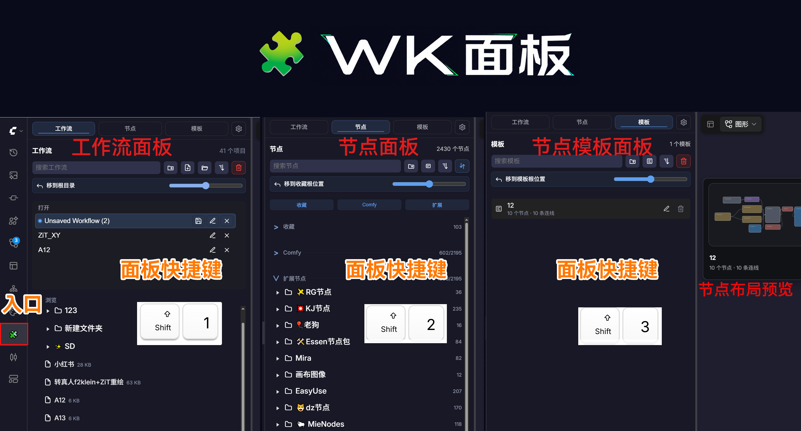
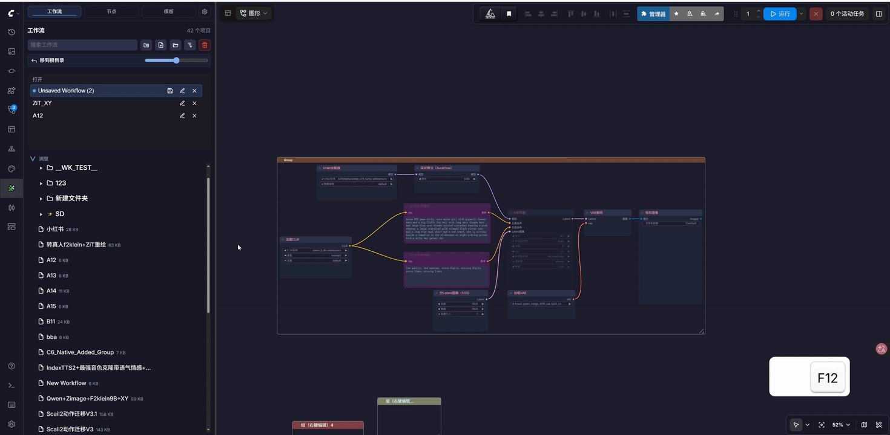
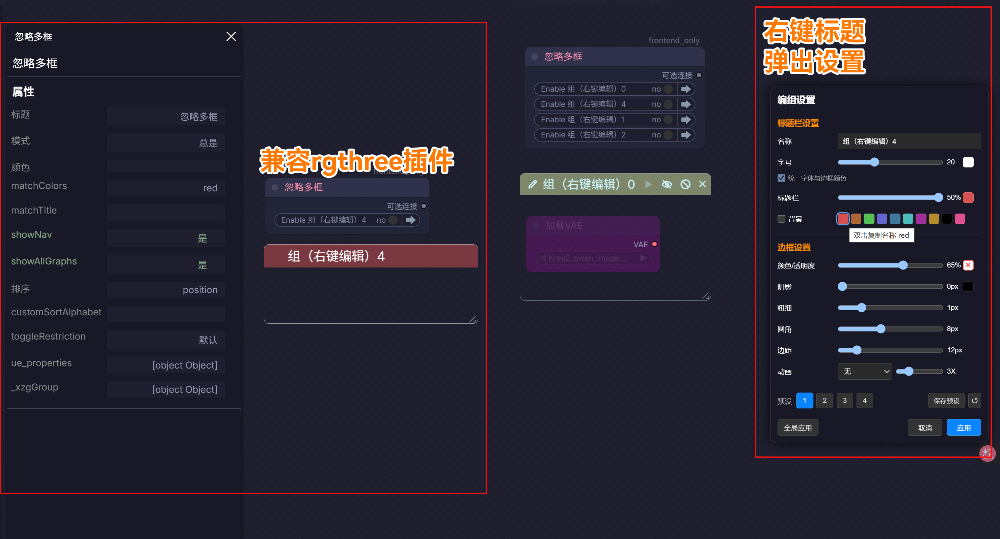
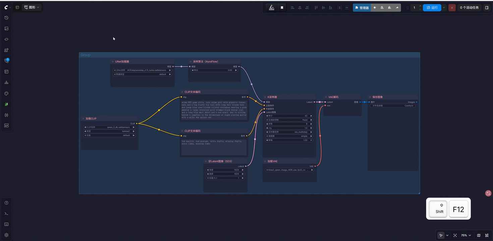
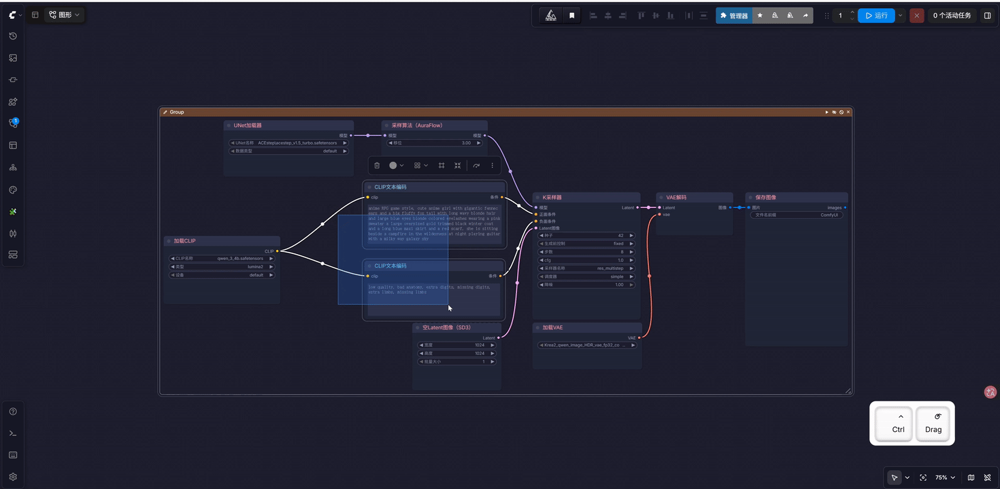
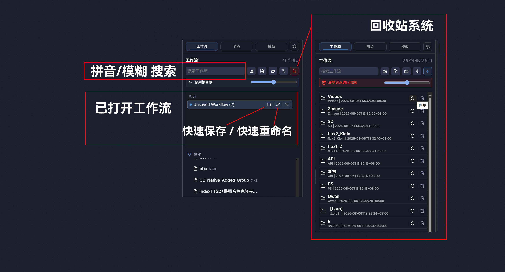
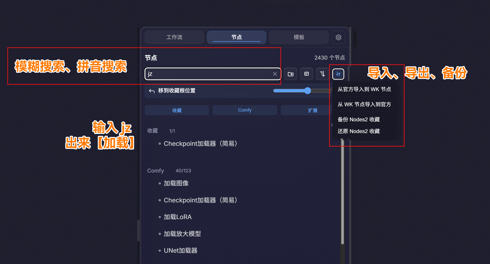
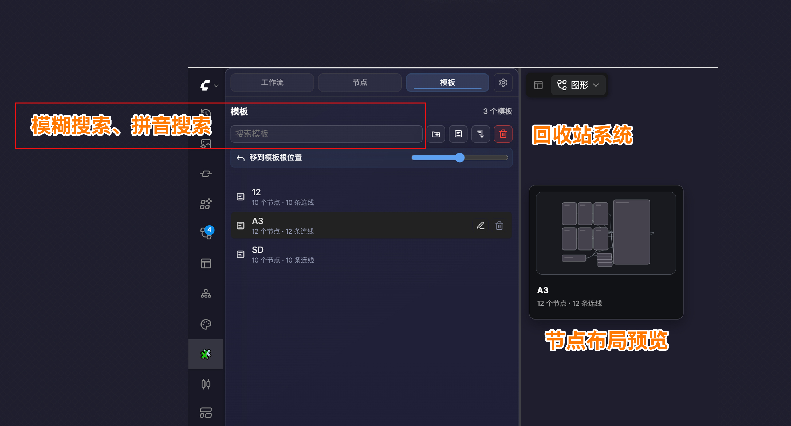
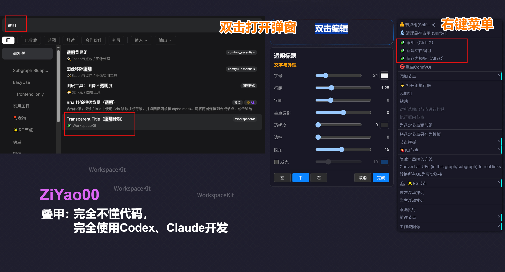

# ComfyUI WorkspaceKit（WK 面板）

[English](README.md) · **简体中文**

> ## ComfyUI 高效率工作区插件
>
> **集中管理工作流、节点收藏与节点模板，并用更顺手的编组方式整理复杂画布。**


ComfyUI WorkspaceKit（WK）的中文正式名是 **WK 面板**。它把工作流管理、节点收藏、模板复用和画布整理放进同一个侧边栏入口。

`ComfyUI-WorkspaceKit` 仍是仓库、安装目录、Provider API、存储键和 Registry 中使用的技术名称；WK 只用于对外品牌与模块称呼。

当前状态：**公开测试版，0.2.5**。还不是稳定版 1.0；首次在主力环境中使用前，请备份重要工作流、用户设置、节点收藏和模板数据。



<p align="center">
  <a href="#为什么做成一个工作区">为什么做成一个工作区</a> ·
  <a href="#功能说明">功能说明</a> ·
  <a href="#安装">安装</a> ·
  <a href="#快捷键">快捷键</a> ·
  <a href="#数据安全与备份">数据安全</a>
</p>

> **维护说明：** 未来 2–3 周更新以及 Issue / PR 回复可能延后。

## 为什么做成一个工作区

在 ComfyUI 中，工作流、节点和节点模板看起来是三种不同内容，但长期使用时反复做的其实是同一组动作：

- 在大量内容中查找目标；
- 按项目、用途或习惯进行分类；
- 拖拽调整位置或放入画布；
- 预览内容，确认后再使用；
- 删除后保留恢复机会。

WorkspaceKit 不替代 ComfyUI 官方界面，也不是把更多按钮堆进侧边栏。它补充的是重度用户逐渐需要的工作区能力：**快速找到内容、保持清晰结构、复用已经搭好的节点，以及在整理失误后找回数据。**

## WK 套件

首次介绍写作 **ComfyUI WorkspaceKit（WK）**，之后可简称为 **WK**。核心模块统一称为：**WK 工作流、WK 节点、WK 模板、WK 编组**；关联模块称为：**WK 版式、WK 主题**。在已打开的侧边栏内，标签保持简洁，直接显示“工作流｜节点｜模板｜版式｜主题”。

| 常见问题 | WorkspaceKit 的做法 | 结果 |
| --- | --- | --- |
| 工作流越积越多 | **WK 工作流**：文件夹树、搜索、拖拽、排序、最近记录 | 按项目整理，更快找到文件 |
| 节点难找难记 | **WK 节点**：来源分类、搜索、拼音搜索、收藏分组 | 建立自己的节点库 |
| 常用结构重复搭建 | **WK 模板**：保留节点位置与连线 | 存一次，随时复用 |
| 大型画布看不清 | **WK 编组 + 透明标题** | 更清晰的工作区域与层级 |
| 误删或迁移丢数据 | **两级回收站 + 数据备份迁移** | 恢复、备份和迁移更安全 |

## 三类工作资产

三个标签属于同一个工作区中的三类资产，共用相近的搜索、树状分组、拖拽和恢复逻辑，同时保留各自最适合的操作。

| 标签 | 管理的内容 | 主要解决的问题 | 常用动作 |
|---|---|---|---|
| **工作流** | 完整的 `.json` 工作流文件 | 工作流长期积累后难以按项目维护 | 建文件夹、搜索、排序、拖动、打开、恢复 |
| **节点** | 当前 ComfyUI 中可用的官方与第三方节点，以及个人收藏 | 插件很多时难以同时记住节点名称、来源和常用程度 | 搜索、收藏分组、预览、放入画布 |
| **模板** | 已经连接好的节点组合 | 常用结构不应每次重新搭建和连线 | 保存、分组、预览、拖入画布、恢复 |

## 统一界面结构

三个内置标签使用统一的界面语言：

- **标签导航**：工作流、节点和模板集中在同一个入口，并支持 `Shift+1`、`Shift+2`、`Shift+3` 快速切换；置顶的兼容扩展可使用 `Shift+4`。
- **标题与状态区**：模块在加载、刷新或处理内容时，在固定位置反馈状态。
- **搜索与操作栏**：搜索框、清空搜索和当前模块操作按钮位于统一区域，并支持 `Esc` 清空搜索。
- **树状内容区**：工作流文件夹、节点收藏分组和模板分组都可以展开、折叠和拖拽整理。
- **右键菜单与行内确认**：重命名、移动、预览、删除等动作尽量放在对象附近；可能造成数据变化的操作保留确认或恢复路径。

按住 `Ctrl` 点击有子层级的文件夹或分组，可以递归展开或折叠当前层级。该操作作用于树形文件夹 / 分组，不适用于“打开 / 浏览”“收藏 / Comfy / 第三方”等区域标题。

## 整理必须可恢复

WorkspaceKit 管理真实的工作流文件，也会保存用户长期积累的节点收藏和模板。因此恢复能力是基础设计，而不是删除按钮后的附加功能。

| 保护设计 | 实际行为 |
|---|---|
| **工作流两级回收流程** | 工作流先进入 WorkspaceKit 回收站，可恢复；确认不再需要后，再移动到系统回收站。 |
| **独立模板回收站** | 删除模板或模板分组后，可从模板回收站恢复。 |
| **写入官方收藏前自动备份** | 与 ComfyUI 官方收藏交换数据时，先备份相关设置文件。 |
| **导入数据前自动备份** | 导入 WorkspaceKit 数据包前，自动备份当前 WorkspaceKit 数据。 |
| **缺失节点保留记录** | 第三方节点暂时未安装或加载失败时，以弱化状态显示，不会被静默删除。 |
| **兼容旧存储位置** | 从 Workspace2 升级到 WorkspaceKit 时，继续读取兼容存储位置，保留已有模板数据。 |

删除流程分为两级：

```text
工作流目录
    ↓ 删除
WK 回收站（可恢复）
    ↓ 确认清理
系统回收站
```

模板使用独立的可恢复模板回收站，不与工作流回收站混用，也不会写入系统回收站。



## 功能说明

### WK 编组



WK 编组不是只给节点套一个框，而是把大型工作流中的一片节点变成可选择、可移动、可切换状态、可统一设置样式的区域。

- 选中节点后按 `Ctrl+G` 创建 WK 编组；
- 按 `Shift+G` 解除一个或多个编组框，不删除其中节点和连线；
- 对已选编组按 `Delete`，只删除编组框，节点和连线会保留；
- `Ctrl/Meta + 左键` 点击标题栏：切换整组**忽略**；
- `Alt + 左键` 点击标题栏：切换整组**禁用**；
- `Shift + 左键` 点击标题栏：加入或移出编组多选；
- 双击标题栏：快速选择当前编组、内部节点以及完整嵌套的子编组；
- 在空白画布 `Ctrl + 拖拽`：在 ComfyUI 原生框选基础上同时选择 WK 编组；
- 节点归属贴近 ComfyUI 原生逻辑：节点中心进入编组区域即成为组内节点；
- 鼠标进入编组区域时才显示标题栏操作按钮，减少大型画布上的视觉干扰；
- 支持整组运行状态反馈；没有可执行输出时，执行按钮会弱化显示；
- 右键标题栏打开样式设置，可调整颜色、背景、边框、边距、阴影、透明度、动画与圆角；
- 支持保存常用编组样式预设；
- 支持 WK 编组与 ComfyUI 原生编组之间的颜色兼容与转换；
- 编组数据随工作流一起保存。

如果 `Ctrl+G` 与 ComfyUI 官方快捷键冲突，请修改官方绑定，或在 WorkspaceKit 设置中关闭对应功能。

原生编组转换为 WK 编组：



WK 编组会记住组内节点的状态：



### WK 工作流



- 默认使用 ComfyUI 官方工作流目录；
- 树状文件夹管理，支持文件夹和子文件夹；
- 新建、重命名、复制、拖拽移动工作流和文件夹；
- 支持搜索、清空搜索、刷新、排序和自定义顺序；
- 支持最近工作流记录；
- 删除后先进入 WorkspaceKit 回收站，可恢复或移到系统回收站；
- 支持文件夹图标与颜色；
- 支持 `Ctrl + 点击` 递归展开或折叠文件夹；
- 支持自定义工作流根目录；
- 支持直接打开工作流所在位置。

**快捷入口：** `Shift+1` / `Shift+W`

| 搜索框右侧按钮 | 作用 |
|---|---|
| 新建文件夹 | 在当前浏览位置创建文件夹。 |
| 新建工作流 | 创建空白工作流。 |
| 导入 | 从本地选择并导入工作流。 |
| 排序 | 按名称、修改时间或自定义顺序显示，可优先显示文件夹。 |
| 回收站 | 查看、恢复或清理已删除工作流；再次点击返回列表。 |

高级用户可以设置自定义工作流根目录。请只选择专门用于存放 ComfyUI 工作流的文件夹，不要选择磁盘根目录、桌面、下载目录或大型项目目录。

#### 解散与全部拍平

文件夹右键菜单提供两种目录整理动作，它们是两个独立操作。

**解散**：只移除当前这一层文件夹，内部文件和子文件夹保留，并整体提升一级。

```text
A/
└─ B/
   └─ C/
      └─ flow.json

解散 B 后：

A/
└─ C/
   └─ flow.json
```

**全部拍平**：移除当前文件夹以及下面所有子文件夹，把内部文件全部提升到上一级。

```text
A/
└─ B/
   └─ C/
      └─ flow.json

全部拍平 A 后：

flow.json
```

- 两者分开，是为了避免一次误操作破坏整棵手工整理的目录结构；
- 「全部拍平」始终要求确认；
- 遇到同名文件时会自动编号，例如 `工作流（2）.json`，扩展名始终保留在最后；
- 同样的整理逻辑也适用于模板分组；
- 更新到包含新后端接口的版本后，请完整重启一次 ComfyUI。

### WK 节点



- 按 **Comfy** 和 **第三方扩展** 区分节点来源；
- 第三方节点按插件来源分组；
- 支持搜索、模糊搜索和拼音搜索；
- 支持收藏根目录、收藏分组和收藏子分组；
- 支持节点拖拽到收藏分组或画布；
- 支持点击节点后再点击画布放置；
- 支持完整 / 紧凑两种节点预览；
- 支持与 ComfyUI 官方收藏导入 / 导出、备份和恢复，写入前自动备份；
- 缺失的第三方节点以弱化状态保留，不会被静默删除；
- 支持节点缓存，便于大型节点库更快显示首屏内容。

**快捷入口：** `Shift+2` / `Shift+N`

| 搜索框右侧按钮 | 作用 |
|---|---|
| 新建收藏分组 | 创建节点收藏分组。 |
| 预览模式 | 切换完整 / 紧凑节点预览。 |
| 排序 | 调整节点显示顺序。 |
| 收藏管理 | 导入、导出、备份和恢复官方收藏与 WorkspaceKit 收藏。 |

### WK 模板



模板是已经连接好的节点组合，适合保存加载器、预处理、控制块、输出链等常用结构。

- 使用 `Alt+C` 将当前选中的节点保存为模板；
- 保存模板时保留节点相对位置和连接关系；
- 支持模板拖拽到画布，或单击后再点击画布放置；
- 支持模板分组、子分组、搜索、排序和重命名；
- 支持模板悬停预览；
- 支持模板行内重命名按钮及右键菜单（重命名、放置到画布中心、删除）；
- 删除模板或模板分组前提供行内确认，删除后可从模板回收站恢复；
- 模板分组同样支持「解散 / 全部拍平」。

**快捷入口：** `Shift+3` · **保存模板：** `Alt+C`

| 搜索框右侧按钮 | 作用 |
|---|---|
| 新建模板分组 | 创建模板分组。 |
| 保存选中节点为模板 | 保存当前选中的节点结构。 |
| 排序 | 调整模板显示顺序。 |
| 回收站 | 查看、恢复或清理已删除模板。 |

测试阶段为保证兼容性，模板数据仍使用 ComfyUI 用户目录下现有的 Workspace2 兼容存储位置；升级后已有模板数据仍可继续使用。请定期备份重要模板数据。

### 透明标题



一个轻量的画布标题 / 注释节点，适合给大型工作流添加区域标题、说明和视觉分隔。在 ComfyUI 节点菜单的 **🧩 WorkspaceKit** 分类下，显示为 **Transparent Title（透明标题）**。

默认样式：

- 字号：24
- 背景：透明
- 圆角：15

## 效率操作

| 操作 | 解决的问题 |
|---|---|
| `Shift+1 / 2 / 3` 切换标签 | 不用寻找多个侧边栏图标，也不用离开当前画布。 |
| 模糊搜索与拼音搜索 | 不记得完整英文节点名时，仍然可以找到目标。 |
| 拖拽到画布或点击后放置 | 兼顾快速操作和狭窄侧边栏中的精确放置。 |
| `Alt+C` 保存模板 | 已经搭好的结构不再重复创建和连线。 |
| 最近工作流记录 | 频繁切换的项目不必重新翻找目录。 |
| 节点缓存 | 大型节点库再次打开时更快显示首屏内容。 |

## 快捷键

| 快捷键 | 功能 |
|---|---|
| `Shift+1` / `Shift+W` | 打开工作流。 |
| `Shift+2` / `Shift+N` | 打开节点。 |
| `Shift+3` | 打开模板。 |
| `Shift+4` | 打开已置顶的兼容扩展标签（存在时）。 |
| `Alt+C` | 将当前选中节点保存为模板。 |
| `Ctrl+G` | 创建 WorkspaceKit 编组。 |
| `Shift+G` | 取消编组，保留节点。 |
| `Delete` | 删除已选编组框，保留节点和连线。 |
| `Ctrl + 点击` 文件夹或分组展开按钮 | 递归展开或折叠。 |
| `Ctrl/Meta + 左键` 编组标题栏 | 切换忽略状态。 |
| `Alt + 左键` 编组标题栏 | 切换禁用状态。 |
| `Shift + 左键` 编组标题栏 | 加入或移出编组多选。 |
| `Ctrl + 拖拽` 空白画布 | 在原生框选中同时选择 WorkspaceKit 编组。 |

## 设置

WorkspaceKit 设置集中管理：

- 模块快捷键与打开行为；
- 编组快捷键和鼠标手势；
- 最近工作流显示数量；
- 透明或磨砂玻璃背景；
- 节点缓存查看与清理；
- WorkspaceKit 数据备份与迁移；
- 兼容扩展是否合并到 WorkspaceKit 标签栏。

关闭某个快捷键后，对应组合键会交还给 ComfyUI 或浏览器。

兼容的外部模块可以通过 Provider API 合并到同一个面板，或者保持独立显示。

## 安装

### 通过 ComfyUI Manager / Registry 安装（推荐）

在 ComfyUI Manager 中搜索 `WorkspaceKit` 或 `comfyui-workspacekit`，安装后重启 ComfyUI。

### 通过 Git 安装

进入 ComfyUI 的 `custom_nodes` 目录：

```bash
cd ComfyUI/custom_nodes
git clone https://github.com/ZiYao00/ComfyUI-WorkspaceKit.git
cd ComfyUI-WorkspaceKit
python -m pip install -r requirements.txt
```

Windows Portable 用户请从 ComfyUI 根目录执行：

```bat
python_embeded\python.exe -m pip install -r ComfyUI\custom_nodes\ComfyUI-WorkspaceKit\requirements.txt
```

完成后重启 ComfyUI。请确保依赖安装在 ComfyUI 实际使用的 Python 环境中，不要随意更新其它依赖。

### 系统回收站依赖

推荐安装 `send2trash`，可直接使用项目依赖：

```bash
pip install -r requirements.txt
```

Windows 提供内置回收站兜底；其他平台通过 `send2trash` 使用系统回收站能力。

## 数据安全与备份

WorkspaceKit 支持导出和导入插件自身管理的数据，适合迁移：

- 节点收藏；
- 模板数据；
- 文件夹元数据；
- WorkspaceKit 设置。

导入前会自动创建备份。工作流文件本身和可重新生成的节点缓存不包含在导出包中。

WorkspaceKit 会实际执行工作流文件的重命名、移动、文件夹移动、删除、恢复、解散和拍平操作。因此即使已经提供 WK 回收站和系统回收站两层保护，首次在主力环境中使用前，仍建议备份：

- ComfyUI 工作流目录；
- ComfyUI 用户设置；
- 重要节点收藏数据；
- 重要模板数据。

## 五分钟上手

1. 从侧边栏打开 WorkspaceKit，用 `Shift+1`、`Shift+2`、`Shift+3` 在工作流、节点和模板之间切换；
2. 在 WK 工作流中新建一个文件夹，把工作流拖进去；
3. 在 WK 节点中搜索一个常用节点，拖进收藏分组；
4. 在画布上选中已连接的节点，按 `Alt+C` 保存为模板；
5. 选中节点按 `Ctrl+G`，创建第一个 WK 编组。

## 当前状态与已知限制

- 当前仍是公开测试版，不是稳定版 1.0；
- 大型工作流目录的扫描与刷新仍可能较慢；
- 清空回收站到系统回收站时，耗时随项目数量线性增加；
- 超大型节点库中的搜索速度、排序和拼音命中质量仍需继续实测；
- 模板回收站已支持恢复，批量恢复和更完整的撤销体验仍可继续完善；
- Registry 已上架，图标、Banner 和教程素材仍可继续完善；
- `main` 分支可能包含尚未进入正式发布的新功能和修复。

## 项目说明

这是一个完全使用 **Codex（ChatGPT）** 开发的项目。我是一名不懂代码的 ComfyUI 设计师和创作者，负责提出需求、设计交互、体验测试与反馈；代码阅读、编写、功能迁移、问题调试和文档整理均由 Codex 完成。

- 项目维护者：ZiYao00
- 项目主页：https://github.com/ZiYao00/ComfyUI-WorkspaceKit
- 开发文档：[开发状态索引](docs/DEVELOPMENT_STATUS.zh-CN.md)、[品牌与命名规范](docs/BRANDING_AND_NAMING.zh-CN.md)、[架构说明](docs/ARCHITECTURE.md)、[模块清单](docs/MODULE_MAP.md)、[测试记录](docs/TESTING.md)、[贡献说明](CONTRIBUTING.md)
- 版本变化：[CHANGELOG.md](CHANGELOG.md)
- 后续计划：[ROADMAP.zh-CN.md](ROADMAP.zh-CN.md)

## 致谢

特别感谢以下项目和作者提供的基础、灵感和参考：

- [ComfyUI-N-Sidebar](https://github.com/Nuked88/ComfyUI-N-Sidebar)
- [comfyui-workspace-manager](https://github.com/11cafe/comfyui-workspace-manager)
- [ComfyUI-xiaozhuguang](https://github.com/xiaozhuguang/ComfyUI-xiaozhuguang)
- [pinyin-pro](https://github.com/zh-lx/pinyin-pro)

WorkspaceKit 参考、迁移或改造了这些项目中的部分思路和实现，但不代表原项目作者参与维护 WorkspaceKit。详细来源说明见 [THIRD_PARTY_NOTICES.md](THIRD_PARTY_NOTICES.md)。

## 许可证

本项目使用 MIT License。

第三方项目代码、思路和改造部分仍遵循其原始许可证，详见 [LICENSE](LICENSE) 和 [THIRD_PARTY_NOTICES.md](THIRD_PARTY_NOTICES.md)。
